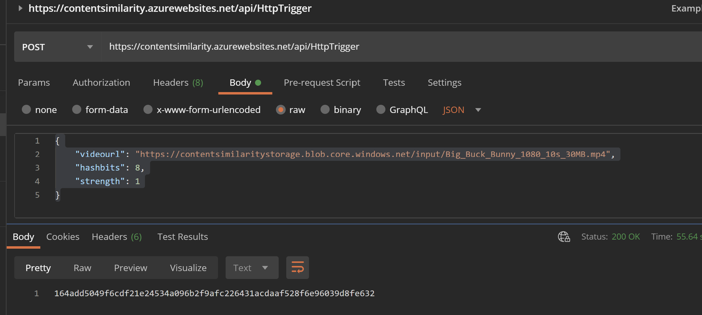

# Video Similarity Sample



This sample represents a [node.js application running in an Azure Function](https://docs.microsoft.com/en-us/azure/azure-functions/functions-reference-node?tabs=v2#node-version-and-package-management). It uses [video-hash](https://www.npmjs.com/package/video-hash) npm package to generate a perceptual hash for an input video file (as shown in the response in the image above). The function will accept an HTTP POST with the body set as follows:

```json
{
    "videourl": "https://contentsimilaritystorage.blob.core.windows.net/input/Big_Buck_Bunny_1080_10s_30MB.mp4",
    "hashbits": 8,
    "strength": 1
}
```

The url must be pointing to a publicly accessible video file. The `hashbits` and `strength` parameters are optional and represent parameters to the perceptual hashing library. Then, if the function is successful the response will contain a value representing the perceptual hash for the file. 'Similar' videos will return the same value.

```curl
curl --location --request POST 'https://contentsimilarity.azurewebsites.net/api/HttpTrigger' \
--header 'Content-Type: application/json' \
--data-raw '{
    "videourl": "https://contentsimilaritystorage.blob.core.windows.net/input/Big_Buck_Bunny_1080_10s_30MB.mp4",
    "hashbits": 8,
    "strength": 1
}'
```

## Deployment

Using Visual Studio Code with the [Azure Functions Tools Extension](https://marketplace.visualstudio.com/items?itemName=ms-azuretools.vscode-azurefunctions) installed you can use the shortcut CTRL+SHIFT+P and start typing `Azure Functions...` and find `Azure Functions: Deploy to Function App...`. This will start a wizard which will lead you through the process of creating a Function App or installing into one if you have one already.

> During this process you will be prompted to create a storage account as that is needed by the function and you could upload a video file to that storage to use to test the function.

## Notes

The Azure Function runtime is 32bit by default so we need to have the 32bit versions of the dependencies installed for that to work. There are a couple of ways to deploy to get this to work:

- Deploy the app and run `npm install` using the Azure Functions console. (There was an issue with this whilst creating the sample that caused the command to not work as expected)

- run `npm install` locally and then deploy your `node_modules` folder along with the app. This requires 32-bit node so if you have only 64-bit you will need to install the 32-bit version and ensure that it gets run when you install the dependencies.
